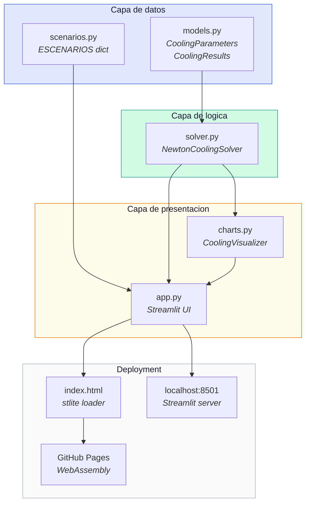
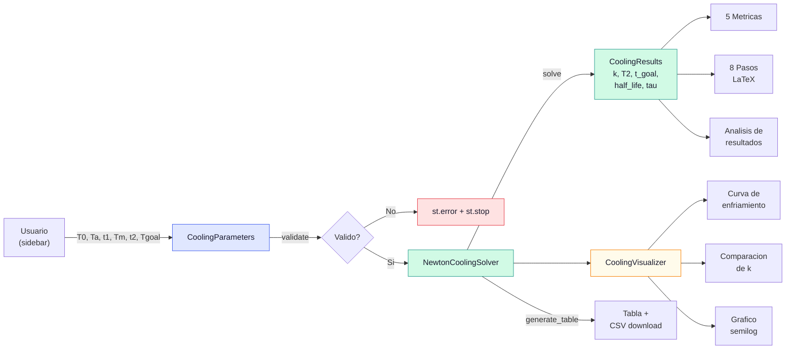
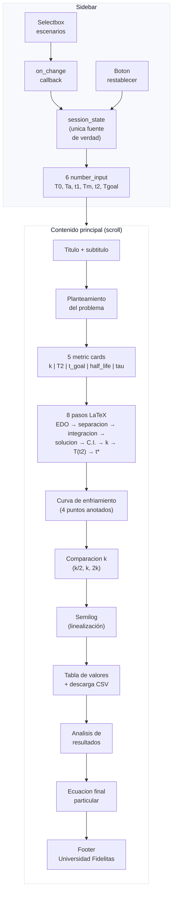
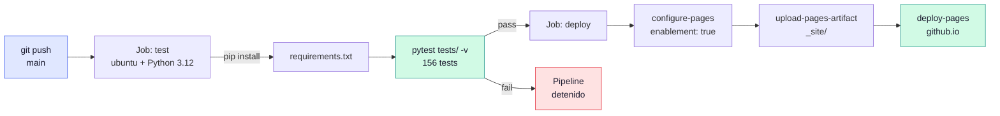
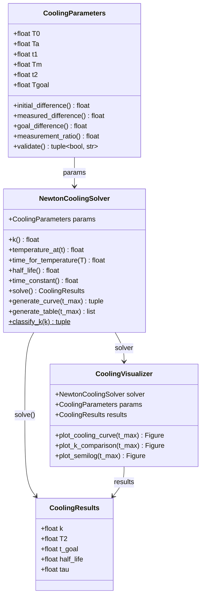

# Ley de Enfriamiento de Newton — Simulador Interactivo

Aplicacion de EDO (separacion de variables) para modelar disipacion termica en GPUs.

**Live demo:** [handelenriquezacuna.github.io/LeyDeEnfriamientoNewton](https://handelenriquezacuna.github.io/LeyDeEnfriamientoNewton/)

Universidad Fidelitas · MA-106 Ecuaciones Diferenciales

---

## Inicio rapido

```bash
pip install -r requirements.txt
streamlit run app.py
```

Se abre en `http://localhost:8501`. Tambien corre en GitHub Pages via [stlite](https://github.com/whitphx/stlite) (WebAssembly, sin servidor).

---

## Arquitectura del sistema



### Modulos

| Archivo | Clase / Contenido | Responsabilidad |
|---------|-------------------|-----------------|
| `models.py` | `CoolingParameters`, `CoolingResults` | Dataclasses con validacion y propiedades derivadas |
| `solver.py` | `NewtonCoolingSolver` | Calculo de k, T(t), t(T), vida media, tabla, curva |
| `scenarios.py` | `ESCENARIOS` | 4 escenarios predefinidos |
| `charts.py` | `CoolingVisualizer` | 3 graficos matplotlib |
| `app.py` | Streamlit UI | Sidebar, LaTeX, metricas, graficos |
| `index.html` | stlite mount | Entry point para GitHub Pages |

---

## Flujo de datos de la aplicacion



---

## Flujo de renderizado de la UI



---

## Pipeline CI/CD



---

## Diagrama de clases



---

## Que resuelve

Dada la EDO `dT/dt = -k(T - Ta)` con solucion analitica `T(t) = Ta + (T0 - Ta) * e^(-kt)`:

1. **(a)** Calcula la constante de enfriamiento `k` a partir de un dato conocido
2. **(b)** Evalua la temperatura en cualquier instante `t`
3. **(c)** Determina el tiempo para alcanzar una temperatura objetivo

Todo resuelto por **separacion de variables** (no metodos numericos).

---

## Funcionalidades

- Sidebar con parametros editables y 4 escenarios predefinidos
- Desarrollo matematico completo paso a paso (8 pasos con LaTeX)
- 3 graficos: curva de enfriamiento, comparacion de k, semilogaritmico
- Tabla de valores con descarga CSV
- Analisis de resultados automatico
- Boton restablecer valores

---

## Tests

```bash
python -m pytest tests/ -v
```

156 tests en 4 modulos:

| Modulo | Tests | Cobertura |
|--------|-------|-----------|
| `test_models.py` | 18 | Validacion de parametros, propiedades derivadas |
| `test_solver.py` | 117 | Calculo de k, T(t), t(T), escenarios, edge cases |
| `test_charts.py` | 8 | Generacion de figuras matplotlib |
| `test_app_visual.py` | 13 | Integracion Streamlit (carga, metricas, LaTeX) |

---

## Estructura de archivos

```
LeyDeEnfriamientoNewton/
├── .github/workflows/
│   └── deploy.yml              CI: test + deploy a Pages
├── .streamlit/
│   └── config.toml             Tema light forzado
├── tests/
│   ├── test_models.py          18 tests
│   ├── test_solver.py          117 tests
│   ├── test_charts.py          8 tests
│   └── test_app_visual.py      13 tests
├── models.py                   Dataclasses
├── solver.py                   Logica matematica
├── scenarios.py                Escenarios predefinidos
├── charts.py                   Visualizacion
├── app.py                      Streamlit UI
├── index.html                  stlite (GitHub Pages)
└── requirements.txt            Dependencias
```

---

## Stack

- Python 3.12+
- Streamlit
- NumPy, Matplotlib, Pandas
- stlite (deployment WebAssembly)
- GitHub Actions (CI/CD)
